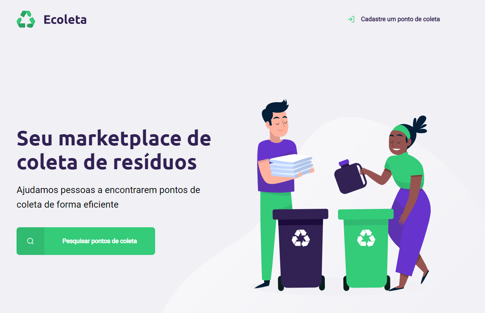
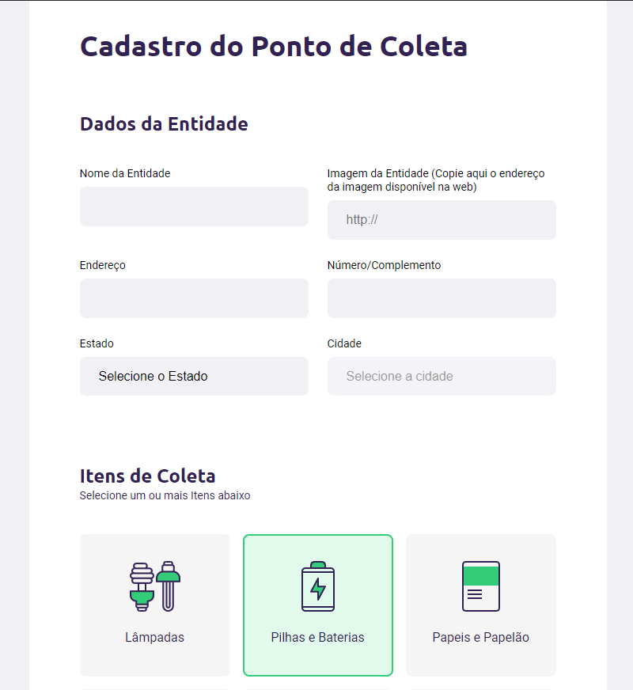
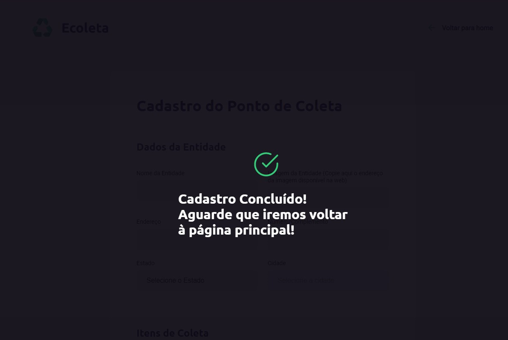
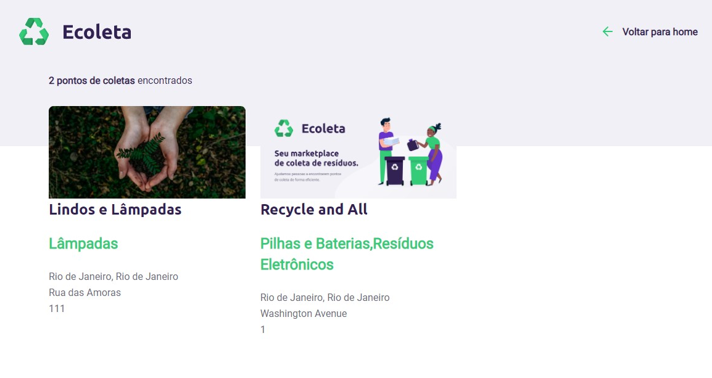

<h1 align="center">
    
</h1>

<h1 align="center">
    
</h1>

<h1 align="center">
    
</h1>

<h4 align="center"> 
	NextLevelWeek 1.0 🚀
</h4>

  
  
  

  
   

## 💻 Project

NLW is a practical week with lots of code, challenges, networking and a single objective: to take you to the next level. Through our method you will learn new tools, learn about new technologies and discover hacks that will boost your career. An online and completely free event that will help you take the next step in your evolution as a dev.

Days

- Day 1: Acelerando sua evolução 01/06/20 - ✔️
- Day 2: Olhando para as oportunidades 02/06/20 - ✔️
- Day 3: A escolha da Stack 03/06/20 - ✔️
- Day 4: Até 2 anos em 2 meses 04/06/20 - ✔️
- Day 5: Milha extra 05/06/20 - ✔️

♻️ Ecoleta is a project developed based on international environment week. That aims to connect people to companies that collect specific waste such as light bulbs, batteries, cooking oil, etc.

<h1 align="center">
    
</h1>

Companies or entities may register on the web platform by sending:
- An image of the collection point;
- Name of the entity;
- Address so that it can appear on the map;
- In addition to selecting one or more collection items:
  - lamps;
  - Batteries;
  - papers and cardboard;
  - electronic waste;
  - organic waste;
  - kitchen oil.

## 🎨 Layout

The application layout is available on Figma:

## Web Application

  

  

  

  

## 📝 License

This project is under the MIT license.

## 🚀 **Developers**

These people contributed to the Readme to be as complete as possible

| <a href="https://github.com/Auriflanos" target="_blank">**Lucas Gonçalves**</a> |
| :---:
| <a href="https://github.com/Auriflanos" target="_blank">***Owner***</a> |
|| 
| <a href="https://www.linkedin.com/in/lucasrgoncalves/" target="_blank">`LinkedIn`</a> | 
| <a href="https://github.com/Auriflanos" target="_blank">`GitHub`</a> | 